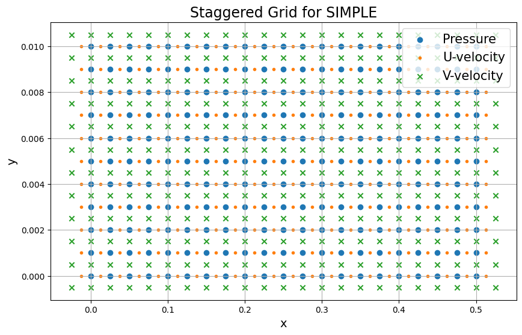

# SIMPLE Staggered Grid Solver for Couette Flow
The repository holds python code for solving the couette incompressible flow problem using a SIMPLE solver with staggered grid. The code replicates Fig. 9.10 of Anderson's "Computational Fluid Dynamics". 

Here's a coarse figure for the staggered grid:

And a figure for the final velocity field in $x$-direction: 

(This project was completed for the ME-840 Computational Fluid Dynamics course at Michigan State University in Spring 2024)
